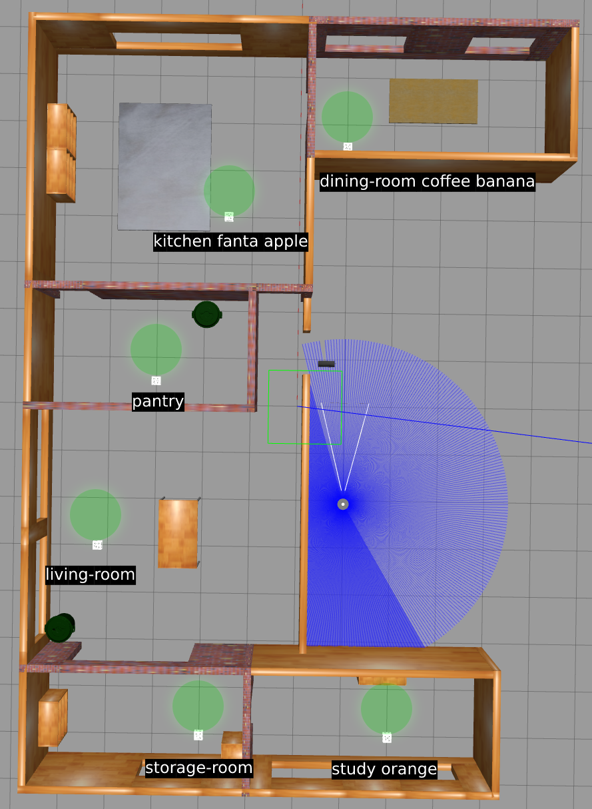

# comp3431-ass3-worlds

This ROS2 package contains a sample world for assignment 3.
Follow standard ROS2 package installation procedure to use.

Students should be comfortable with building and installing ROS2 packages from source by now. If not,
ask your teammates, tutors or on Webcms.

## Launching the sample house1 world

**house1** is the sample world provided in this package.

```
ros2 launch comp3431_ass3_worlds house1.launch.py
```

## Rooms

The new QR code blocks will have an encoded string with the room name and the items in the room. The encoded string will start with the room name, then all items, all separated by a whitespace. Room names and item names are guaranteed to be lower case and separated by "-" if they consit of more than one word (eg. "living-room"). This naming follows PDDL's conventions, so you can the room and item names directly when creating your PDDL problem file. The QR code text for house1 is given below.

There is one QR code per room, and it is guaranteed that there is always going to be at least one metre free space directly in the map's +x direction from the QR code. Nav2 will fail to navigate the robot exactly to the QR code's position as it considers the QR code as an obstacle. The green area exists to guarantee a space you can request Nav2 to navigate to. This area is depicted with a green circle in the digram.




## Important Note

The launching of the world was done for you in script `turtlebot3_startup.sh` given in assignment1.
The contents of that file are as below:

```
source ~/turtlebot3_ws/install/setup.bash &&
ros2 launch turtlebot3_gazebo turtlebot3_house.launch.py &
ros2 launch turtlebot3_cartographer cartographer.launch.py use_sim_time:=true
```

Note that the line given to launch the sample house1 world, is a replacement of the second line above.
This means that if you `turtlebot3_startup.sh` after launching the house1 world, you're trying to launch two worlds.
My recommendation would be to add the "setup.bash" line to your bashrc, and add the third cartographer line to a launch file you will write to run all of your nodes in assignment3.
